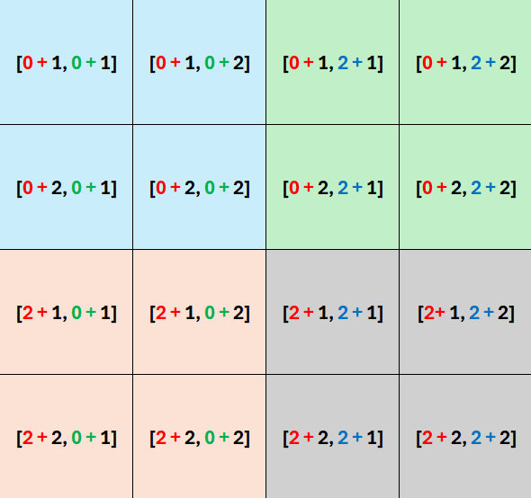
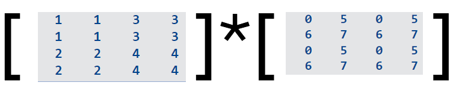

## STAT 385 Lab 6 Vectorization Help Document

## Why Vectorization?

* Avoid using for loops in R when possible.
* Use vectorization whenever you can.

## Kronecker Product

In mathematics, the Kronecker product, sometimes denoted by $\bigotimes$, is an operation on two matrices of arbitrary size resulting a block matrix. It is a specialization of the tensor product (which is denoted by the same symbol) from vectors to matrices and gives the matrix of the tensor product linear map with respect to a standard choice of basis. The Kronecker product is to be distinguished from the usual matrix multiplication, which is an entirely different operation. The Kronecker product is also sometimes called **matrix direct product**. 

* You can find more information about Kronecker Product on Wikipedia <https://en.wikipedia.org/wiki/Kronecker_product>.


## Mathemetical Definition of Kronecker Product

If $\mathbf{A}$ is an $m \times n$ matrix and $\mathbf{B}$ is a $p \times q$ matrix, then the Kronecker product $\mathbf{A}\bigotimes \mathbf{B}$ is the $pm \times qn$ block matrix:


$$\mathbf{A}\bigotimes \mathbf{B} = \begin{bmatrix}
a_{11}\mathbf{B}\quad  \cdots \quad a_{1n}\mathbf{B}\\
\vdots\quad  \ddots\quad  \vdots\\
a_{m1}\mathbf{B}\quad  \cdots \quad a_{mn}\mathbf{B}
\end{bmatrix},$$

more explicitly,

$$\mathbf{A}\bigotimes \mathbf{B} =\left[\begin{array}{cccccccccc}
a_{11}b_{11}&  a_{11}b_{12} & \cdots & a_{11}b_{1q}& \cdots& \cdots& a_{1n}b_{11}&  a_{1n}b_{12} & \cdots & a_{1n}b_{1q} \\
a_{11}b_{21}&  a_{11}b_{22} & \cdots & a_{11}b_{2q}& \cdots& \cdots& a_{1n}b_{21}&  a_{1n}b_{22} & \cdots & a_{1n}b_{2q} \\
\vdots& \vdots&  \ddots&  \vdots & & & \vdots& \vdots&  \ddots&  \vdots \\
a_{11}b_{p1}&  a_{11}b_{p2} & \cdots & a_{11}b_{pq}& \cdots& \cdots& a_{1n}b_{p1}&  a_{1n}b_{p2} & \cdots & a_{1n}b_{pq} \\
\vdots& \vdots&  &  \vdots & \ddots& & \vdots  & \vdots& & \vdots \\
\vdots& \vdots&  &  \vdots & &\ddots & \vdots  & \vdots& & \vdots \\
a_{m1}b_{11}&  a_{m1}b_{12} & \cdots & a_{m1}b_{1q}& \cdots& \cdots& a_{mn}b_{11}&  a_{mn}b_{12} & \cdots & a_{mn}b_{1q} \\
a_{m1}b_{21}&  a_{m1}b_{22} & \cdots & a_{m1}b_{2q}& \cdots& \cdots& a_{mn}b_{21}&  a_{mn}b_{22} & \cdots & a_{mn}b_{2q} \\
\vdots& \vdots&  \ddots&  \vdots & & & \vdots& \vdots&  \ddots&  \vdots \\
a_{m1}b_{p1}&  a_{m1}b_{p2} & \cdots & a_{m1}b_{pq}& \cdots& \cdots& a_{mn}b_{p1}&  a_{mn}b_{p2} & \cdots & a_{mn}b_{pq}
\end{array}\right],$$


## Kronecker Product Example


$$A = \begin{bmatrix}
1 \quad 3 \\
2 \quad 4
\end{bmatrix}$$

$$B = \begin{bmatrix}
0 \quad 5 \\
6 \quad 7
\end{bmatrix}$$


Then 


$$\mathbf{A}\bigotimes \mathbf{B} = \left[\begin{array}{cccc}
1\times 0 & 1\times 5 & 3\times 0 & 3\times 5\\
1\times 6 & 1\times 7 & 3\times 6 & 3\times 7\\
2\times 0 & 2\times 5 & 4\times 0 & 4\times 5\\
2\times 6 & 2\times 7 & 4\times 6 & 4\times 7
\end{array}\right] =
\left[\begin{array}{cccc}
0 & 5 & 0 & 15\\
6 & 7 & 18 & 21\\
0 & 10 & 0 & 20\\
12 & 14 & 24 & 28
\end{array}\right].$$


## Calculate Kronecker Product in R

Let $A$ and $B$ be $2 \times 2$ matrices as follows:

```{r}
(A <- matrix(1:4, nrow = 2))
(B <- matrix(c(0, 6, 5, 7), nrow = 2))
```


## Method I: The `kronecker()` Function

```{r}
A
B
kronecker(A, B)
```


## Method II: For Loop

$$\mathbf{A}\bigotimes \mathbf{B} = \left[\begin{array}{cccc}
1\times 0 & 1\times 5 & 3\times 0 & 3\times 5\\
1\times 6 & 1\times 7 & 3\times 6 & 3\times 7\\
2\times 0 & 2\times 5 & 4\times 0 & 4\times 5\\
2\times 6 & 2\times 7 & 4\times 6 & 4\times 7
\end{array}\right] =
\left[\begin{array}{cccc}
0 & 5 & 0 & 15\\
6 & 7 & 18 & 21\\
0 & 10 & 0 & 20\\
12 & 14 & 24 & 28
\end{array}\right].$$
Locations:

{fig-align="center"  width=40%}

```{r}
forloop_kronecker <- function(A, B){
  Res = matrix(NA, nrow = 2*2, ncol = 2*2)
  k = 0
  l = 0
  
  for (j in 1:2){
    k = 0
    for (i in 1:2){
      Res[(k+1):(k+2), (l+1):(l+2)] <- A[i, j] * B
      k = k + 2
    }
    l = l + 2
  }
  Res
}

forloop_kronecker(A, B)
```

## Method III: Vectorization [Recommended]

### Objective 

{fig-align="center"  width=70%}


### Deal with A

<!-- ```{r, echo = FALSE} -->
<!-- A -->

<!-- A[rep(1:2, each = 2), rep(1:2, each = 2)] -->

<!-- ``` -->

Recall 

```{r}
rep(1:2, each = 2)
```


```{r}
A

A[rep(1:2, each = 2), rep(1:2, each = 2)]
```


### Deal with B

<!-- ```{r, echo = FALSE} -->
<!-- B -->
<!-- B[rep(1:2, times = 2), rep(1:2, times = 2)] -->
<!-- ``` -->

Recall

```{r}
rep(1:2, times = 2)
```


```{r}
B
B[rep(1:2, times = 2), rep(1:2, times = 2)]
```


### Put Everything Together

```{r}
repeated_A <- A[rep(1:2, each = 2), rep(1:2, each = 2)]
repeated_B <- B[rep(1:2, times = 2), rep(1:2, times = 2)]
repeated_A * repeated_B
```


### Wrap the Calculation into a Function (for $2 \times 2$ matrices)


```{r}
vectorization_kronecker <- function(A, B){
  repeated_A <- A[rep(1:2, each = 2), rep(1:2, each = 2)]
  repeated_B <- B[rep(1:2, times = 2), rep(1:2, times = 2)]
  return(repeated_A * repeated_B)
}

vectorization_kronecker(A, B)

```

## Compare the CPU Times that Expressions Used


```{r}
microbenchmark::microbenchmark(
  vectorization_kronecker(A,B),
  kronecker(A, B),
  forloop_kronecker(A, B),
  times=10000L
)
```

## What if A and B are not $2 \times 2$ matrices?

With the assistance of this instructional document, please proceed with Lab 6.

In Lab 6, you will update the `forloop_kronecker()` and `vectorization_kronecker()` functions to make them suitable for calculating matrices A and B with arbitrary dimensions. And find result similar to the following.

```{r, echo = FALSE}

forloop_kronecker <- function(A, B){
  Res = matrix(NA, nrow = nrow(A)*nrow(B), ncol = ncol(A)*ncol(B))
  k = 0
  l = 0
  
  
  for (j in 1:ncol(A)){
    k = 0
    for (i in 1:nrow(A)){
      Res[(k+1):(k+nrow(B)), (l+1):(l+ncol(B))] <- A[i, j] * B
      k = k + nrow(B)
    }
    l = l + ncol(B)
  }
  return(Res)
}

vectorization_kronecker <- function(A, B){
  repeated_A <- A[rep(1:nrow(A), each = nrow(B)), rep(1:ncol(A), each = ncol(B))]
  repeated_B <- B[rep(1:nrow(B), times = nrow(A)), rep(1:ncol(B), times = ncol(A))]
  return(repeated_A * repeated_B)
}
```


```{r}
A1 <- matrix(1:16, nrow = 4, ncol = 4)
B1 <- matrix(1:20, nrow = 4, ncol = 5)

A2 <- matrix(1:40, nrow = 5, ncol = 8)
B2 <- matrix(1:50, nrow = 10, ncol = 5)
```


* Compare the CPU Times that Expressions Used for `A1` and `B1`

```{r}
# A1 and B1
microbenchmark::microbenchmark(
  vectorization_kronecker(A1,B1),
  kronecker(A1, B1),
  forloop_kronecker(A1, B1),
  times=10000L
)
```


* Compare the CPU Times that Expressions Used for `A2` and `B2`
```{r}
# A2 and B2

microbenchmark::microbenchmark(
  vectorization_kronecker(A2,B2),
  kronecker(A2, B2),
  forloop_kronecker(A2, B2),
  times=10000L
)
```

