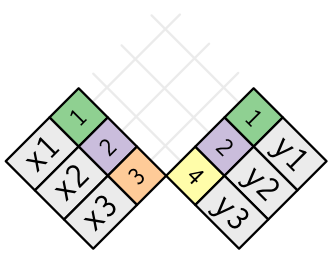

```{r setup, include=FALSE}
knitr::opts_chunk$set(warning = FALSE, message = FALSE, fig.dim=c(6,4.5))

```

## Data Science Workflow

> {width="55%"}

## Tidy Data

> Happy families are all alike; every unhappy family is unhappy in its own way. — Leo Tolstoy

> Tidy datasets are all alike, but every messy dataset is messy in its own way. — Hadley Wickham, author of *R for Data Science*

-   Tidy data is data where:
    -   Every column is variables.
    -   Every row is an observation.
    -   Every cell is a single value.

{width="35%"}


```{r}
library(tidyverse)
table1
table2
table3
table4a
table4b
```

Which table is tidy? Table 1? Table 2? Table 3? Or Table 4?


-   Learn more about tidy data in `vignette("tidy-data")`.

## Data Transformation

-   "Pivoting" which converts between long and wide forms
    -   `pivot_longer()` -- "lengthens" data
    -   `pivot_wider()` -- "widens" data
-   "Splitting" and "Combining" -- splits or combines character columns
    -   `separate_wider_delim()`, `separate_wider_position()`, `separate_wider_regex()` -- turns a single character column into multiple columns.
    -   `unite()` -- pastes together multiple columns into one.
-  `inner_join()`, `left_join()`, `right_join()`, `outer_join()` -- join tables


## pivot_longer()

`pivot_longer()` -- "lengthens" data, increasing the number of rows and decreasing the number of columns.

```{r, eval=FALSE}
pivot_longer(data_frame, 
             cols, 
             ### columns selected to pivot into longer format
             names_to = "name", 
             ### original column-names go to the new "name" column
             values_to = "value") 
             ### original column-values go to the new "value" column
```

## Example 1

Recall `table4a` in the `tidyverse` package. This table is not tidy as the variable `cases` is scattered across two columns. In other words,

-   The column names (`1999` and `2000`) should be values of the `year` variable
-   The values ($745, 2666, \cdots$) should be values of the `cases` variable.

{width="50%"}

## Example 1.1

### `table4a`

```{r}
library(tidyverse)
table4a
```

### Use `pivot_longer()` to "lengthen" the data table `table4a`

```{r}
table4a %>% pivot_longer(cols = c(`1999`, `2000`), 
                         names_to = "year", 
                         values_to = "cases")

```

### Create table4 by join the tidy versions of `table4a` and `table4b`

-   Use `pivot_longer()` to "lengthen" the data table `table4a` to `table4a_tidy` (variables: `year` and `cases`)
-   Use `pivot_longer()` to "lengthen" the data table `table4b` to `table4b_tidy` (variables: `year` and `population`)
-   Then join the two tidy tables to `table4`.

```{r}
table4a_tidy <- table4a %>% pivot_longer(cols = c(`1999`, `2000`), 
                         names_to = "year", 
                         values_to = "cases")
table4b_tidy <- table4b %>% pivot_longer(cols = c(`1999`, `2000`), 
                         names_to = "year", 
                         values_to = "population")
table4 <- left_join(table4a_tidy, table4b_tidy)
table4
```


## pivot_wider()

`pivot_wider()` -- "widens" data, increasing the number of columns and decreasing the number of rows.

```{r, eval=FALSE}
pivot_wider(data_frame, 
            names_from = name,
            values_from = value)
```

-   `names_from` and `values_from` -- a pair of arguments
-   `names_from` -- the original column where the new columns names are from
-   `values_from` -- the original column where the new columns values are from

## Example 2

Recall `table2`. This table is not tidy as an observations is a country in a year, but each observation is spread across two rows. In other words,

-   The `cases` and `population` should be variable names
-   The values ($745, 2666, \cdots$) should be values of the `cases` or `population` variable.

{width="50%"}

## Example 2.1

### table2

```{r}
table2
```

### Use `pivot_wider()` to "widens" the data table `table2`

```{r}
library(tidyverse)

table2 %>% pivot_wider(names_from = type, 
                       values_from = count)

```


## Separate

Turns a single character column into multiple columns:

* `separate_wider_delim()` -- splits by delimiter
* `separate_wider_position()` -- splits at fixed widths
* `separate_wider_regex()` -- splits with regular expression matches

## Example 3


Recall `table3`. This table is not tidy as one column `rate` contains two variables `cases` and `population`. To fix this problem, we'll need the `separate`-type functions.

{width="50%"}

```{r}
table3 %>% 
  separate_wider_delim(rate, delim = "/", names =  c("cases", "population"))
```


Using  `separate_wider_position()`  to separate the variable `year` in `table3` to columns `century` (dropped) and `year_last2`.

```{r}
table3 %>% 
  separate_wider_position(year, c(2, year_last2 = 2))
```


## unite()

`unite()` -- a convenience function to paste together multiple columns into one.

```{r, eval = FALSE}

unite(data_frame, 
      cols, 
      ### vector of columns to be combined
      sep)
      ### separator
```

## Example 4

Combine the century and year values in table5.

```{r}
table5
```

`unite()` is the inverse of `separate`: it combines multiple columns into a single column.

We combine the century and year values.

```{r}
table5 %>% 
  unite(new, century, year)
```

-   There is a understore between century and year above.
-   Remove the underscore

```{r}
table5 %>% 
  unite(new, century, year, sep = "")
```


## Understand joins

It's rare that data analysis involves a single table of data. Multiple tables of data are called relational data. 

For example, in the `nycflights13` package, the `airlines`, `airports`, `planes`, `weather` are related to the `flights` data in the following way. 

{width=50%}

## Different join functions

* `inner_join()`
* `left_join()`
* `right_join()`
* `full_join()`


## Example 5

To learn how joins (`left_join`, `right_join`, `inner_join`, `outer_join`, etc.) works, we use the toy example and a visual representation below. 


```{r}
x <- tribble(
  ~key, ~val_x,
     1, "x1",
     2, "x2",
     3, "x3"
)
y <- tribble(
  ~key, ~val_y,
     1, "y1",
     2, "y2",
     4, "y3"
)

```

{width=20%}

### Inner join

```{r}
x %>% inner_join(y, by = "key")
```

{width=20%}


### Outer joins

* `left_join()`
* `right_join()`
* `full_join()`

```{r}
x %>% left_join(y, by = "key")
x %>% right_join(y, by = "key")
x %>% full_join(y, by = "key")
```

{width=20%}

Another way to depict the different types of join is with a Venn diagram:

{width=40%}

## Example 6

Working with two small dataframes: `superheroes` and `publishers`.

```{r}
superheroes <- tibble::tribble(
       ~name, ~alignment,  ~gender,          ~publ,
   "Magneto",      "bad",   "male",            "Marvel",
     "Storm",     "good", "female",            "Marvel",
  "Mystique",      "bad", "female",            "Marvel",
    "Batman",     "good",   "male",                "DC",
     "Joker",      "bad",   "male",                "DC",
  "Catwoman",      "bad", "female",                "DC",
   "Hellboy",     "good",   "male", "Dark Horse Comics"
  )

publishers <- tibble::tribble(
  ~publ, ~yr_founded,
        "DC",       1934L,
    "Marvel",       1939L,
     "Image",       1992L
  )
```

Let's display the tibbles.

```{r}
superheroes

publishers

```

* The key variable name is `publ`, which needs to be exactly the same in the two dataframes.

## Quiz

* Tibbles `superheroes` and `publishers`

```{r, echo=FALSE, fig.dim=c(8, 2)}
library(gridExtra)
library(grid)
grid.arrange(tableGrob(superheroes, theme = ttheme_default(base_size = 10)), tableGrob(publishers, theme = ttheme_default(base_size = 10)), ncol=2)
```

Please match the output tables with the join functions used. 

{width=100%}


## Quiz Solution

* Tibbles `superheroes` and `publishers`

```{r, echo=FALSE, fig.dim=c(8, 2)}
library(gridExtra)
library(grid)
grid.arrange(tableGrob(superheroes, theme = ttheme_default(base_size = 10)), tableGrob(publishers, theme = ttheme_default(base_size = 10)), ncol=2)
```

Please match the output tables with the join functions used. 

{width=100%}


## Example 6.1 -- inner_join()

```{r}
superheroes %>% inner_join(publishers, by = "publ")
```

* `inner_join` returns all rows from `superheros` where there are matching values in `publishers`.
* We lose **Hellboy** as his publisher Dark Horse Comics does not appear in `publishers`.

## Example 6.2 -- left_join()

```{r}
superheroes %>% left_join(publishers, by = "publ")
```

* `left_join` returns all rows from `superheros`.
* We get all columns in `superheros` back, with the addition of variable `yr_founded`, which is unique to `publishers`.
* **Hellboy**, whose publisher Dark Horse Comics does not appear in `publishers`, has an `NA` for `yr_founded`.

## Example 6.3 -- right_join()

```{r}
superheroes %>% right_join(publishers, by = "publ")
```

* `right_join` returns all rows from `publishers`.
* We get all columns in `publishers` back, with the addition of variables `name`, `alignment`, `gender`, which is unique to `superheroes`.
* **Image**, the publisher has no corresponding superhero, has `NA`s for `name`, `alignment`, `gender`.


## Example 6.4 -- full_join()

```{r}
superheroes %>% full_join(publishers, by = "publ")
```

* `rull_join` returns all rows and columns from `superheroes` and `publishers`.
* Where there are not matching values, use `NA`.


## Reference books
* R for Data Science: https://r4ds.hadley.nz/
* Hands-on Programming with R: https://rstudio-education.github.io/hopr/
* R Graphics Cookbook: https://r-graphics.org/
* Statistical Inference via Data Science: A Modern Dive into R and the Tidyverse, by Chester Ismay, Albert Y. Kim
* https://stat545.com/join-cheatsheet.html

### Reference resources on tidyverse on github
https://github.com/stmorse/intro-tidyverse

https://github.com/rstudio-education/welcome-to-the-tidyverse
