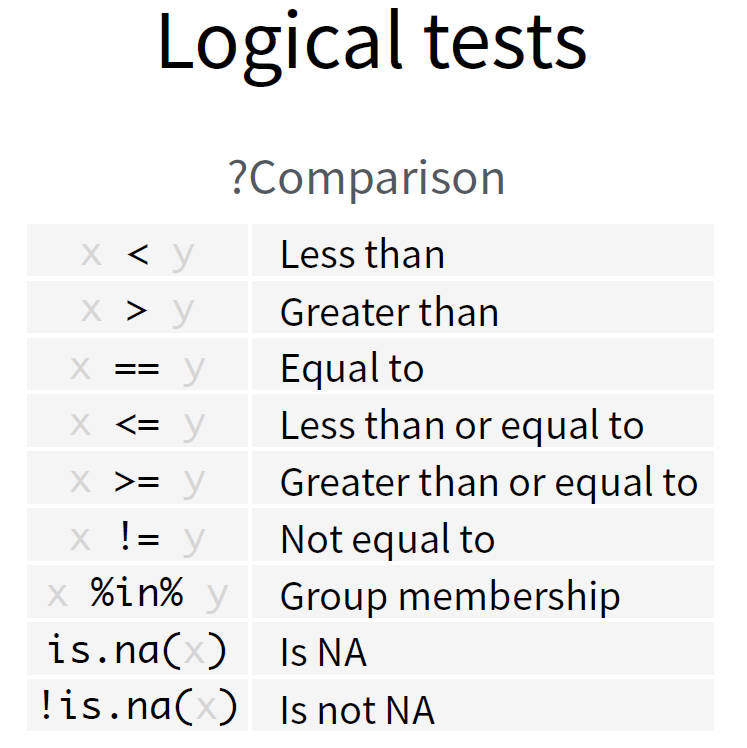
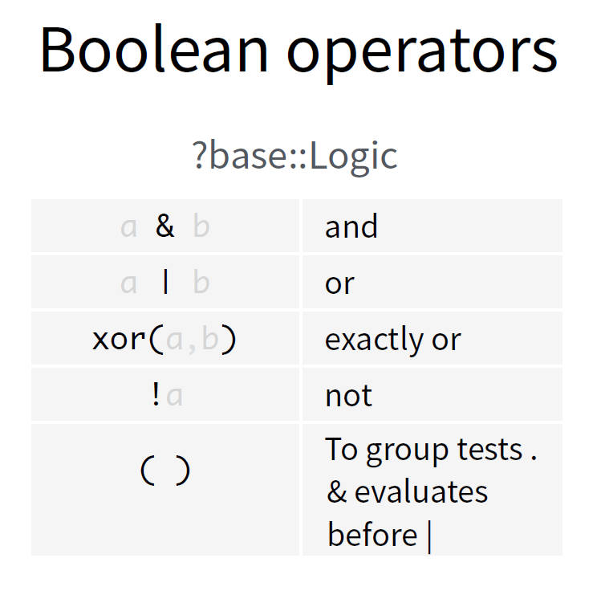
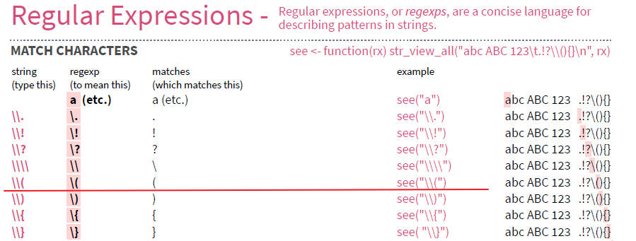
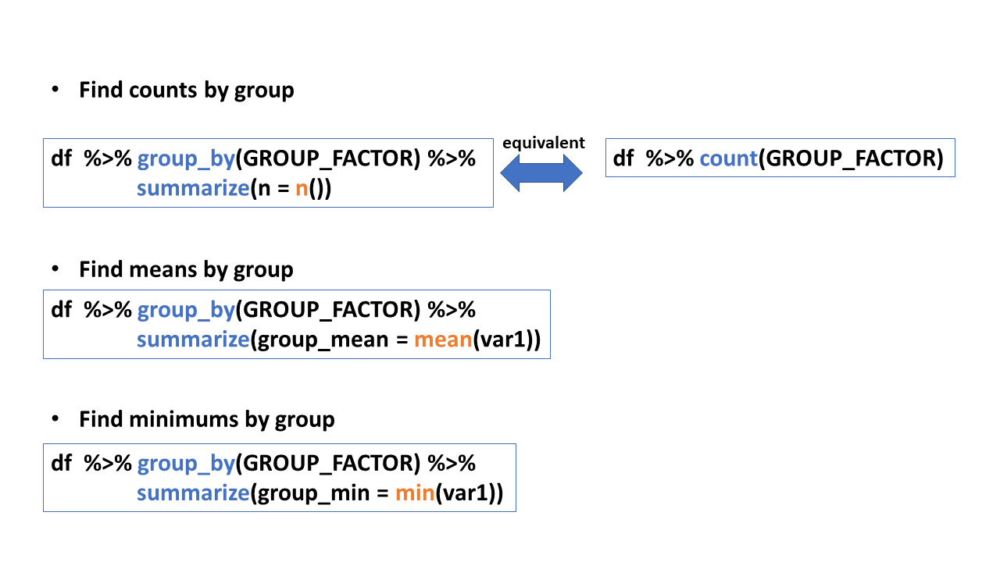

```{r setup, include=FALSE}
knitr::opts_chunk$set(warning = FALSE, message = FALSE, fig.dim=c(6,4.5))

```


## dplyr

> {width=5%}

* Core member in tidyverse
* A package that **transforms** data
* dplyr implements a grammar for **transforming tabular** data. 
* dplyr cheat sheet
<https://nyu-cdsc.github.io/learningr/assets/data-transformation.pdf>

## Commonly used commands in dplyr

* select() -- extract variables
  + Recommended to always use `dplyr::select()`
* filter() -- extract cases
* arrange() -- reorder cases
* mutate() -- create new variables
  + n() -- number of values/rows
  + n_distinct() -- number of unique
* group_by() -- group cases
* summarize() -- summarize variables 
  + Note: summarise() and summarize() are synonyms.
  + Recommended to always use `dplyr::summarize()`
* count() -- count number of rows in each group


# select()

## `select()` -- Extract columns (variables) by name

* Select variables *var1* and *var3* from the data frame `df` 

> `select(df, var1, var3)`

* Select range of variables *var1, var2, var3* from the data frame `df`

> `select(df, var1:var3)`

* Select every column but variables *var1* and *var2* from the data frame `df`

> `select(df, -c(var1, var2))`

* Select every column

> `select(df, everything())`

> `select(df, var7, everything())` -- Place var7 first, followed by all other variables


## Example 1

Let's use the `mpg` tibble in ggplot2. Please use `help(mpg)` for the variable definitions. 

```{r}
library(tidyverse)
mpg

```


### Recall: *check missing values* code chunk -- from the previous lecture

```{r}
mpg %>% 
  dplyr::select(everything()) %>% # use everything() to select all variables
  summarize_all(~sum(is.na(.))) # summarize_all() affects every variable
```


## Example 2

List the distinct model names (using the variable *model*) in the `mpg` tibble.

```{r}
mpg %>% 
  dplyr::select(model) %>% 
  distinct()
```

* There are 38 distinct model names!


## Example 3

The *model* variable has too many categories to be useful. Please remove the column *model* and save the new tibble as `mpg1`.

```{r}
mpg1 <- mpg %>% 
  dplyr::select(-model)
names(mpg1)
```


# filter()

## `filter()` -- Extract rows by logical criteria

Extract rows that meet logical criteria from the data frame `df` 

> `filter(df, logical_criteria)`

### Logical Tests and Boolean Operators

> {width=20%}
{width=20%}

## Example 4

From the `mpg1` tibble, create a sub-tibble named *DODGE* with the manufacture being *dodge* only. 

```{r}
DODGE <- mpg1 %>% 
  filter(manufacturer == "dodge")
dim(DODGE)

```


## Example 5

From the `mpg1` tibble, create a sub-tibble named *DODGE_SUV* with the manufacture being *dodge* and vehicle class being *suv*. 

```{r}
DODGE_SUV <- mpg1 %>% 
  filter(manufacturer == "dodge" & class == 'suv')

# Or equivalently,
DODGE_SUV <- mpg1 %>% 
  filter(manufacturer == "dodge", class == 'suv')

dim(DODGE_SUV)

```


## Example 6
Draw a scatterplot of *hwy* vs *displ* (highway mileage vs engine displacement in liters) for the Japanese cars only (the Japanese manufacturers are *honda, nissan, subaru*, or *toyota*), colored by *manufacturer*. 

### Example 6.1

From the `mpg1` tibble, create a sub-tibble named *Japanese_car*.

```{r}
Japanese_car <- mpg1 %>% filter(manufacturer %in% c("honda", "nissan", "subaru", "toyota"))
dim(Japanese_car)

```


### Example 6.2
Use the *Japanese_car* tibble to draw the scatterplot of *hwy* vs *displ*. Recall that, `geom_point()` could be used. 

```{r}
ggplot(Japanese_car, aes(x = displ, y = hwy, col = manufacturer)) +
  geom_point()

```

### Combine the Example 6.1 and 6.2

```{r}
mpg1 %>% 
  filter(manufacturer %in% c("honda", "nissan", "subaru", "toyota")) %>% 
  ggplot(aes(x=displ, y=hwy, col= manufacturer)) +
  geom_point()
```


# arrange()

## `arrange()` -- reorder rows by the value of one or more columns (variables)

* `arrange()` is used to reorder rows of data.
* Order will be based on values in a specified column.
* The default order will be *ascending* order. 
* To achieve descending order `desc()` will be used within `arrange()`.


## Example 7

In the workshop data (i.e. DS Workshop Participants List.csv), select the variables *Name, Department, Major* only, sort depend on the `Major` variable.

##### Step 1. Import the workshop data in csv  into R, using `read_csv()` command in `readr` package.

```{r}
tbl_workshop = read_csv("DS Workshop Participants List.csv")
tbl_workshop
```

##### Step 2. Select the columns *Name, Department, Major*  only.

##### Step 3. Sort the tibble by `Major`.


```{r}
tbl_workshop %>% 
  dplyr::select(Name, Department, Major) %>% 
  arrange(Major) 
```

**Note that**:

* The tibble is sorted by `Major` in **alphabetical** order,  in **ascending** order.

* Missing values (i.e. `NA`) are always sorted at the end.


## Example 7 (continue)

In the workshop data (i.e. DS Workshop Participants List.csv), select the variables *Name, Department, Major* only, sort depend on the `Major` variable.

#### If sort the tibble by `Major` in descending order is preferred...

```{r}
tbl_workshop %>% 
  dplyr::select(Name, Department, Major) %>% 
  arrange(desc(Major)) ### Use desc() to re-order in descending order
```


## Example 8

From the `mpg1` tibble,  draw a bar graph of the vehicle classes (variable *class*) to go in descending order.

### Example 8.1

Draw a bar graph of vehicle classes. 

```{r}
ggplot(mpg1, aes(class)) +
  geom_bar() 
```

## Example 8

From the `mpg1` tibble, draw a bar graph of the vehicle classes (variable *class*) to go in descending order.


### Example 8.2

Use `arrange()` to sort the bar graph in descending order. 


##### Step 1. Find the counts for each class type

```{r}
mpg1 %>% count(class)

```

##### Step 2. Use `arrange()` to sort the counts

```{r}
mpg1 %>% count(class) %>% 
  arrange(desc(n)) ## desc() means in descending order
```


##### Step 3. Chain the code to ggplot with `geom_col()`

```{r}
mpg1 %>% count(class) %>% 
  arrange(desc(n)) %>%
  ggplot(aes(class, n))+
  geom_col() 

```

Q: `arrange()` has been used. Why still not sorted?

## Example 8

Draw a bar graph of the vehicle classes (variable `class`) to go in descending order. 


### Example 8.2 (continue)

Q: `arrange()` has been used. Why the bar graph created is still not sorted?

A: You need to save the order.


#### Code from the previous slide

```{r, eval=FALSE}
mpg1 %>% count(class) %>%
  arrange(desc(n)) %>%
  ggplot(aes(class, n))+
  geom_col() 

```


#### Output after using arrange()

```{r}
mpg1 %>% count(class) %>%
  arrange(desc(n))

```

#### Then use `fct_inorder()` to keep this descending order.

* `fct_inorder()` -- Reorder factor levels by the order in which they first appear.

```{r}
mpg1 %>% count(class) %>%
  arrange(desc(n)) %>%
  mutate(class = fct_inorder(class))%>% ### save the order
  ggplot(aes(class, n))+
  geom_col()
```


  

## Example 9. Sort the data by multiple variables

From the `mpg1` tibble, create a tibble that satisfies:

1. the manufacture is *toyota*,
2. select variables *class, year, displ* only,
3. sort the tibble depend on *class*, *year*, and *displ*, where *class* and *year* are in ascending order, *displ* is in descending order.  


```{r}
mpg1 %>% filter(manufacturer == "toyota") %>% 
  dplyr::select(class, year, displ) %>% 
  arrange(class, year, desc(displ)) %>% 
  print(n=15) ### Print 15 rows

```


#### From the output above, it seems like the *displ* values increase as the *year* grow for the *compact* vehicle type. Is it true for the other vehicle types?

We could create a scatterplot to visualize the change.

```{r}
mpg %>% filter(manufacturer == "toyota") %>% 
  dplyr::select(class, year, displ) %>% 
  ggplot(aes(x = year, y = displ))+
  geom_jitter(size = 3, height = 0, width = 0.3, alpha = 0.5)+
  geom_smooth(se = FALSE) +
  facet_wrap(~class)
```


<!-- ## Summarize -->


<!-- * select() -- extract columns or variables -->
<!-- * filter() -- extract rows or cases -->
<!-- * arrange() -- reorder cases -->


<!-- * mutate() -- create new variables -->
<!--   + n() -- number of values/rows -->
<!--   + n_distinct() -- number of uniques -->
<!--   <!-- + sum(!is.na())-- number of non-NA's --> -->
<!-- * group_by() -- group cases -->
<!-- * summarize() -- summarize variables  -->
<!--   + Note: summarise() and summarize() are synonyms. -->
<!-- * count() -- count number of rows in each group -->


<!-- * Useful function -->

<!--   + Center: `mean(), median()` -->
<!--   + Spread: `sd(), IQR(), mad()` -->
<!--   + Range: `min(), max(), quantile()` -->
<!--   + Position: `first(), last(), nth()` -->
<!--   + Count: `n(), n_distinct()` -->
<!--   + Logical: `any(), all()` -->
  

## mutate() 

* Use `mutate()` to add new variables and preserves existing ones.


## Example 10

Please create a new column `combined_mpg` in `mpg` using the formula of 

> combined_mpg = 0.55 * cty + 0.45 * hwy


```{r}
mpg %>% mutate(combined_mpg = 0.55*cty + 0.45*hwy) %>% 
  print(width = Inf) ## use print(width = Inf) to display all the columns

```


## Example 11

Please compare the *frequency* and *engine displacement average (variable `displ`)* between the two transmissions (auto vs manual).

### Example 11.1

Let's first find the distinct transmission types (with sub types). 

* Use `distinct()` to display the distinct transmission types (with sub types) -- variable `trans`. 

* Use `n_distinct` to find how many transmission types (with sub types). 

## Example 11

Please compare the *frequency* and *engine displacement average (variable `displ`)* between the two transmissions (auto vs manual).

### Example 11.1

Let's first find the distinct transmission types with sub types. 

* Use `distinct()` to display the distinct transmission types (with sub types) -- variable `trans`. 

* Use `n_distinct` to find how many transmission types (with sub types).

```{r}
mpg %>% 
  select(trans) %>%
  distinct()

### Find just the count of distinct categories
mpg %>% 
  select(trans) %>%
  n_distinct()

```

* There are 10 distinct transmission types with sub types.
* But we only need to compare auto and manual transmission types. 


## Example 11

Please compare the *frequency* and *engine displacement average (variable `displ`)* between the two transmissions (auto vs manual).

### Example 11.2

Use `mutate()` function to create a new variable `trans` with transmission type only, without sub types. 


## Example 11

Please compare the *frequency* and *engine displacement average (variable `displ`)* between the two transmissions (auto vs manual).

### Example 11.2

Use `mutate()` function to create a new variable `trans_type` with transmission type only, without sub types. 

```{r}
mpg_transtype <- mpg %>%
  rowwise() %>% ## rowwise() groups the data by row. 
  mutate(trans_type = str_split(trans, "\\(")[[1]][1]) %>%
  ungroup() ## Use ungroup() to drop the rowwise behavior. 


```

```{r}
mpg_transtype %>% distinct(trans_type)
```

### Do you have questions about the code above?
Please find the illustration in the next two slides of

* `str_split(trans, "\\(")[[1]][1]` 
* `rowwise()` 

## Example 11.2 code -- illustration of `str_split()`

* `str_split()` is from stringr package. The function can be used to split a string into multiple pieces. 

> `str_split(string, pattern)`

where 

    * string is a character vector,
    * pattern is the pattern to split on.

* In this example, 
  + you type `\\(` to match `(`, which is the separator.
  
  > {width=45%}
  
  + Please refer to the stringr cheat sheet for more information. 

```{r}
str_split("auto(l5)", "\\(")
```
 

* We only need "auto" in this example. Therefore,

    * Use `[[1]]` to get the first element in this list -- result in a vector,
    * Then use `[1]` get the first value of the vector.

```{r}
str_split("auto(l5)", "\\(")[[1]]
```

```{r}

str_split("auto(l5)", "\\(")[[1]][1]
```


## Example 11.2 code -- illustration of `rowwise()`

If `rowwise()` is not used,


```{r}
mpg %>% 
  mutate(trans_type = str_split(trans, "\\(")[[1]][1]) %>% 
  dplyr::select(trans_type, trans)

```

All are **`auto's** in the **trans** column!

* Therefore, we need to perform the calculation **by row** to get the values for variable trans.
* After the `mutate()` function, use `ungroup()` to drop the rowwise behavior. 


# group_by(), summarize(), count()

## Summarize information by groups

* Find summary statistics by group

{width=60%}

<!-- * Find group_mean of variable `Var1` by group (variable: GROUP_FACTOR) from the data frame `df`  -->

<!-- > `df %>% group_by(GROUP_FACTOR) %>% summarize(group_mean = mean(var1))` -->


<!-- * Find counts by group (variable: GROUP_FACTOR) from the data frame `df`  -->

<!-- > `df %>% group_by(GROUP_FACTOR) %>% summarize(freq = n())` -->

<!-- > This is equivalent to: `df %>%  count(GROUP_FACTOR)` -->


* Useful function

  + Center: `mean(), median()`
  + Spread: `sd(), IQR(), mad()`
  + Range: `min(), max(), quantile()`
  + Position: `first(), last(), nth()`
  + Count: `n(), n_distinct()`
  + Logical: `any(), all()`
  
## Example 11

Please compare the *frequency* and *engine displacement average (variable `displ`)* between the two transmissions (auto vs manual).

### Example 11.3 

Use `group_by()`, `summarize()` and `n()` to find the frequency of the two transmission types.

#### Frequency table

```{r}
mpg_transtype %>% 
  group_by(trans_type) %>%
  dplyr::summarize(freq = n())

### Or equivalently,
mpg_transtype %>% count(trans_type)
```


#### Bar graph


We could show the counts visually using ggplot.

```{r}
mpg_transtype %>% 
  group_by(trans_type) %>%
  dplyr::summarize(freq = n()) %>%
  ggplot(aes(trans_type, freq)) +
  geom_col()
          
```


## Example 11

Please compare the *frequency* and *engine displacement average (variable `displ`)* between the two transmissions (auto vs manual).

### Example 11.4

Use `mean()` to compare the engine displacement average between the two transmissions (auto, manual).

```{r}
mpg_transtype %>% 
  group_by(trans_type) %>%
  dplyr::summarize(displ_avg = mean(displ))

### or Visually using ggplot
mpg_transtype %>% 
  group_by(trans_type) %>%
  dplyr::summarize(displ_avg = mean(displ)) %>%
  ggplot(aes(trans_type, displ_avg))+
  geom_col()
           
```

<!-- **Question:** It seems like auto transmission has much higher displacement value than manual transmissions. Why is that? -->

<!-- **Answer: ** Let's display the `displ_avg` vs `trans` across different vehicle classes and compare. -->

<!-- ```{r} -->
<!-- mpg1 %>%  -->
<!--   group_by(trans_type, class) %>% -->
<!--   dplyr::summarize(displ_avg = mean(displ)) %>% -->
<!--   ggplot(aes(trans_type, displ_avg))+ -->
<!--   geom_col() + -->
<!--   facet_wrap(~class) -->
<!-- ``` -->

## Example 11.5

If you need to 

* group by multiple variables, or
* calculate several grouped summary statistics

Please read Example 11.5 on the next slide. 


## Example 11.5 


Get a list of grouped summary statistics (min, Q1, median, Q3, max, mean, std. dev., missing) by *transmission type* (without sub group) **and** *class type*. 

```{r}

displ_summary <- mpg_transtype %>%
  group_by(trans_type, class)%>%
  dplyr::summarize(
    min = min(displ, na.rm = TRUE),
    q1 = quantile(displ, 0.25, na.rm = TRUE),
    median = quantile(displ, 0.5, na.rm = TRUE),
    q3 = quantile(displ, 0.75, na.rm = TRUE),
    max = max(displ, na.rm = TRUE),
    mean = mean(displ, na.rm = TRUE),
    sd = sd(displ, na.rm = TRUE),
    missing = sum(is.na(displ))
  )

displ_summary

```
